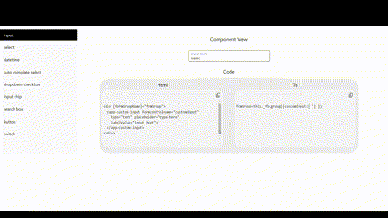

## Demo



### Add assets and style configuration in angular.json
```

    "assets": [
              {
                "glob": "**/*",
                "input": "node_modules/ng-ui-extension/assets",
                "output": "assets"
              }
            ],
    "styles": [
              "@angular/material/prebuilt-themes/deeppurple-amber.css"
              ]
```
